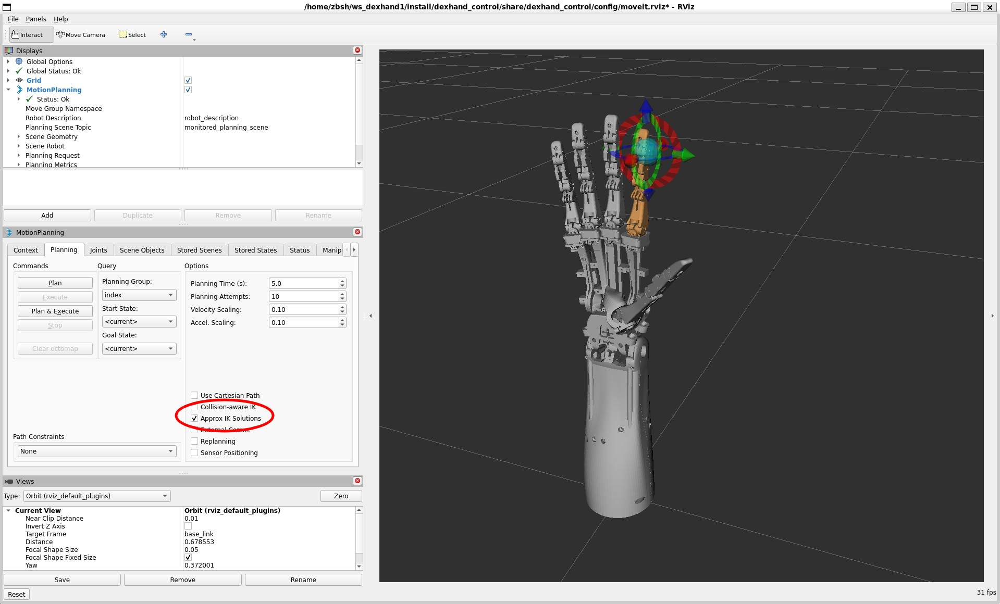

# dexhand_control ROS2 Package

## Overview

`dexhand_control` is a ROS2 package designed for controlling the DexHand robotic system thrugh MOVEIT2 package. It provides functionalities for managing the robotic hand's movements and interactions.

## Dependencies

Ensure the following dependencies are installed in your ROS2 environment:

- `ros2_control`: ROS2 control framework for managing controllers.
- `ros2_controllers`: ROS2 package providing various controllers for robot joints.
- [`dexhand_description`](https://github.com/iotdesignshop/dexhand_description): Package 
- `moveit2`: ROS2 package for motion planning and manipulation.
containing the DexHand robot description files.

The following commands will install some of the dependencies.

```
sudo apt install ros-humble-moveit 
```

```
sudo apt install ros-humble-ros2-control 
```

```
sudo apt install ros-humble-ros2-controllers
```

you will also need to clone the [`dexhand_description`](https://github.com/iotdesignshop/dexhand_description) to your src folder.

## Installation

1. Clone this repository into your ROS2 workspace, src folder

```
cd ..
```

```
colcon build
```

```
source /opt/ros/humble/setup.bash
```

```
source install/setup.bash   
```
to launch the demo package

```
ros2 launch dexhand_control demo.launch.py
```
When demoing the dexhand moveit package, make sure to activiate "approx IK solution" as shown in the following image.

